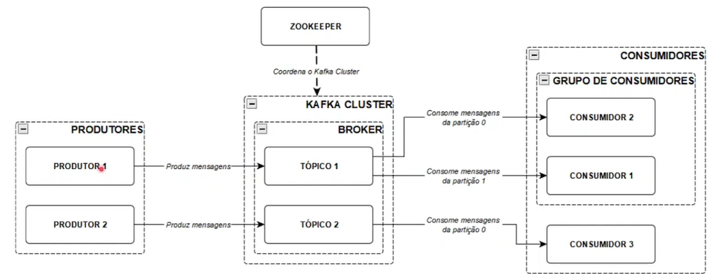

# Apache Kafka (created by LinkedIn)

- Confluent Enterprise manages the Kafka cluster.
- Persists data on disk, not in memory. But it is very fast.
- Streaming data platform distributed and open source.
- Mensagery system scalable and durable.

## Kafka Structure

- 
  - Producer: Publishes data to Kafka Cluster
  - Kafka Cluster: Have one or more Brokers (has one Broker Leader), processes data from Producer and sends it to Consumer
  - Broker: Have one or more Topics.
  - Topic: Have one or more Partitions
  - Partition: Have one or more Offsets
  - Consumer Group: Have one or more Consumers (Better approach)
  - Consumer: Consumes data from Kafka Cluster
  - Zookeeper: Manage the Kafka Cluster
